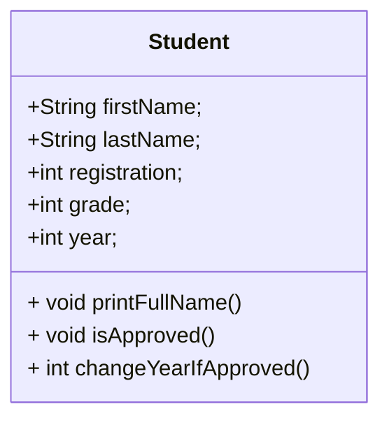

# JAVA-9 - Object Oriented Programming - Fundamentals

 <br/>
 <br/>
 
 
 ## Part 1: Exploring the School System Project
 
 1. Download the src folder and import the project into IntelliJ Idea
 2. To give instructions for these and the next exercises, we'll something called class diagrams.
    * Class diagrams are a form of representing classes and relationships between them
    * We'll learn more about the symbols in future sessions, but for now, all you need to know is where to locate attributes and methods in a basic class diagram:
        * 

 4. Create the class described by the following diagram:




As the diagram specifies, the class should have the following attributes:

 ```java
    public class Student {
        String firstName;
        String lastName;
        int registration;
        int grade;
        int year;
    }
 ```

And the following methods:

 
 ```java
    public void printFullName(){
       //TODO implement
    }

    public void isApproved(){
        //TODO implement: should return true if grade >= 60
    }

    public int changeYearIfApproved(){
        //TODO implement: the student should advance to the next year if he/she grade is >= 60
        // Make year = year + 1, and print "Congragulations" if the student has been approved
        return 0;
    }
 ```
 
4. Add constructors to your Student class

    * Make the class with at least three different constructors

5. Create a Java class for Courses

    * Your Course class must have, as attributes: courseName, professorName, year
    * Your class must also contain a collection that lists all students enrolled in them
    * Implement the following methods

 
 ```java
    public void enroll(Student student){
       //TODO add the student to the collection
    }

    public void unEnroll(Student student){
        //TODO remove this student from the collection
        // Hint: check if that really is this student
    }

    public int countStudents(){
        //TODO implement
        return 0;
    }
    
    public int bestGrade(){
        //TODO implement
        return 0;
    }
 ```

6. Run the main method and verify that your implementation works.

## Challenge yourself

* Implement a function that calculates the average grade for that course
* Implement a function that outputs a ranking with all students enrolled in a course and respective grades
* Implement a function that, for each student, show if he/she is above course average or not


 